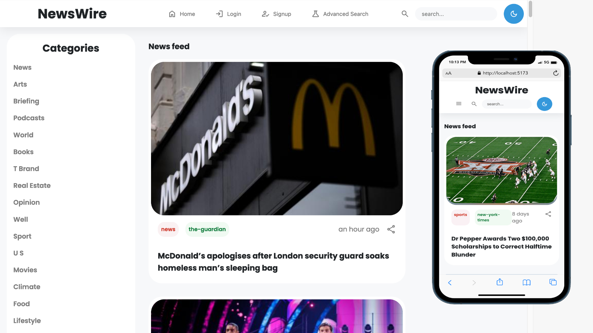
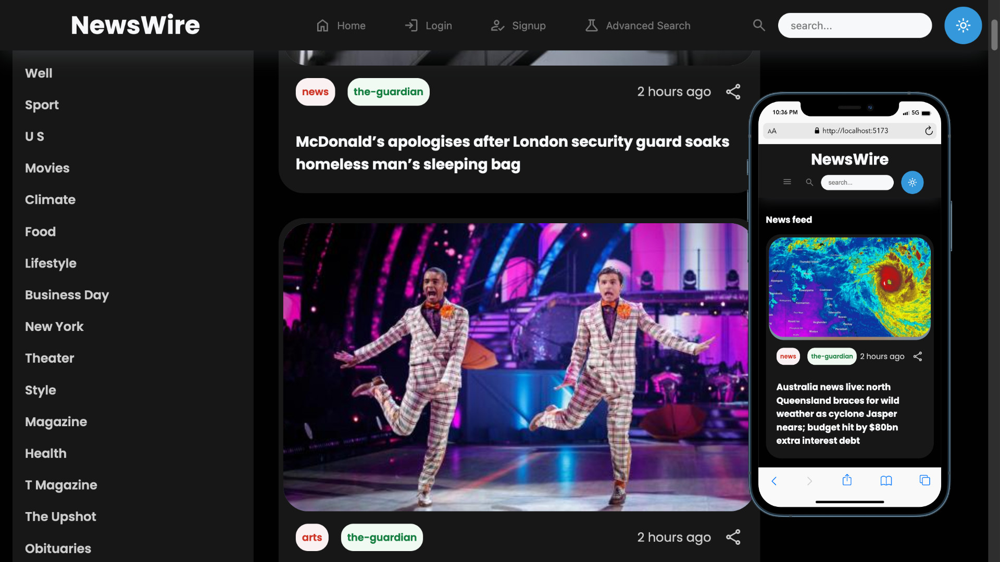

# **NewsWire**
A news aggregator website that pulls articles from various sources and displays them in a clean, easy-to-read format

### end-to-end preview :

&nbsp;

### Screenshots :

&nbsp;

### Description:

The backend scrapes the most recent news every 30 minutes in a cron job from different news APIs and store them in local database to allow users to search.

The registered users can customize their preferences and settings to choose their favorite news categories and sources for their feed.

### Tech stack:

##### **Backend:**&nbsp;&nbsp;&nbsp;   PHP 8 / Laravel 10

##### **Frontend:**&nbsp;&nbsp;  React ( TypeScript ) / Redux

##### **DevOps:**&nbsp;&nbsp;&nbsp;&nbsp;    Docker&nbsp;,&nbsp;Cypress ( E2E testing )

### Practices Covered:

- Components re-rendering optimization 
- “Load more” data technique with backend pagination
- Lazy Loading images 
- Custom hooks usage
- Dark theme with css only
